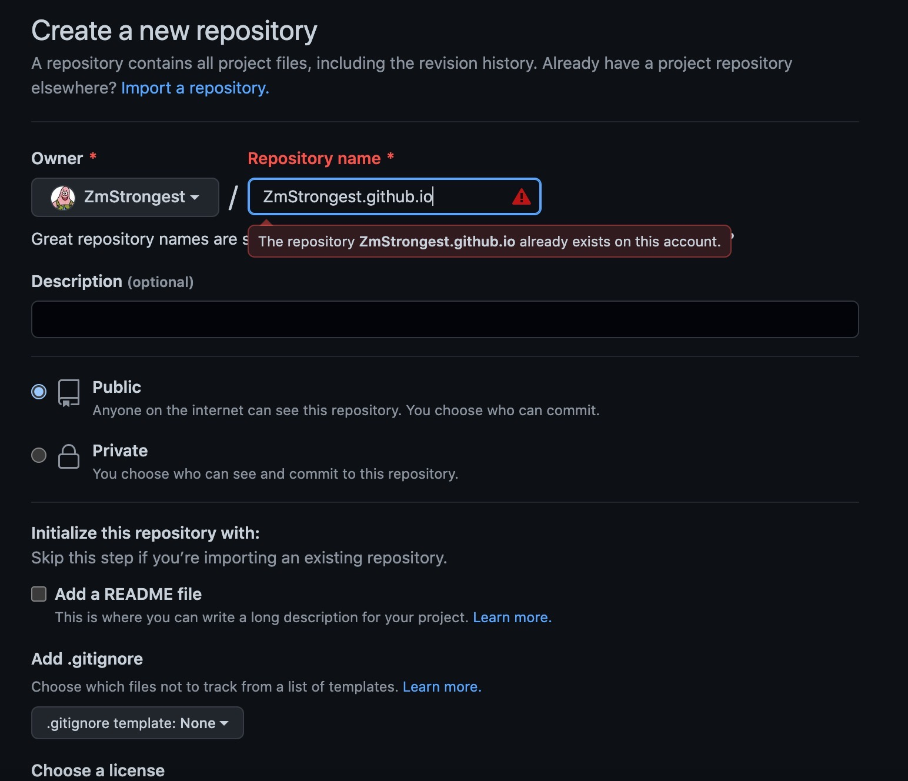
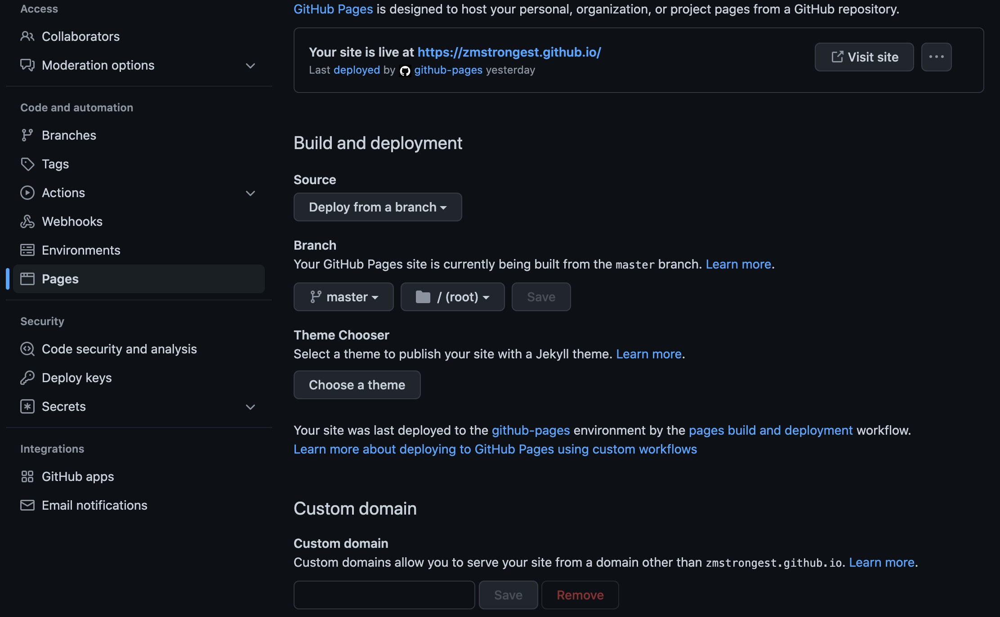
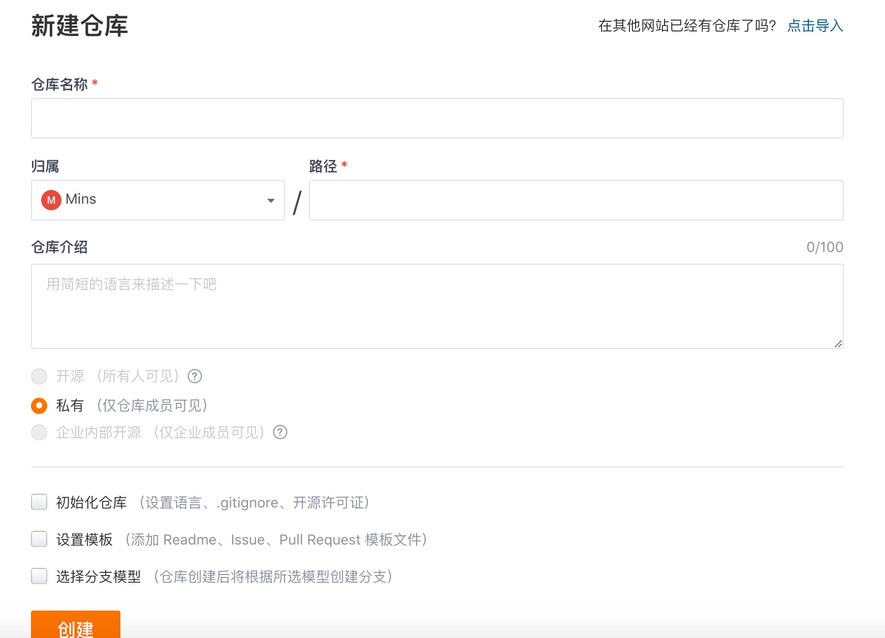
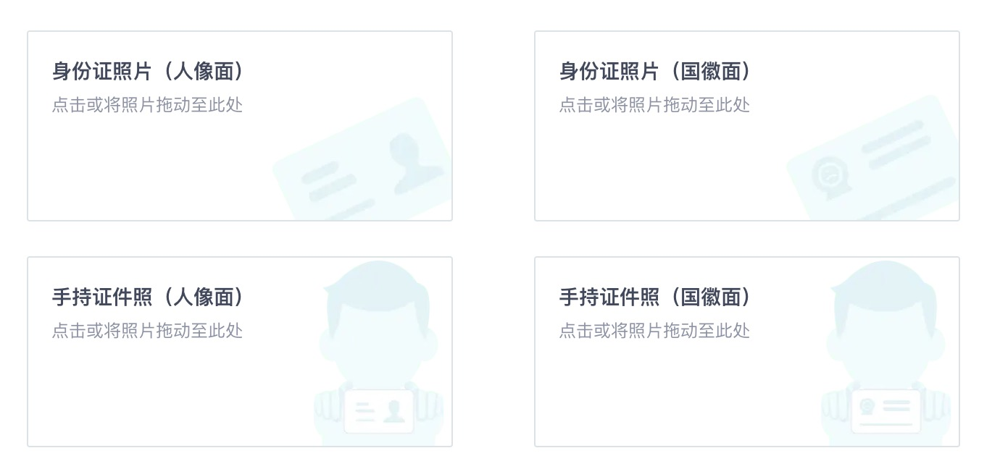
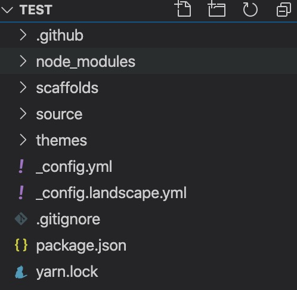
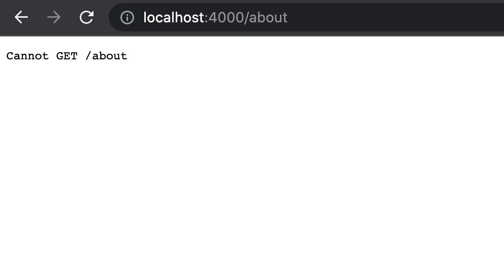
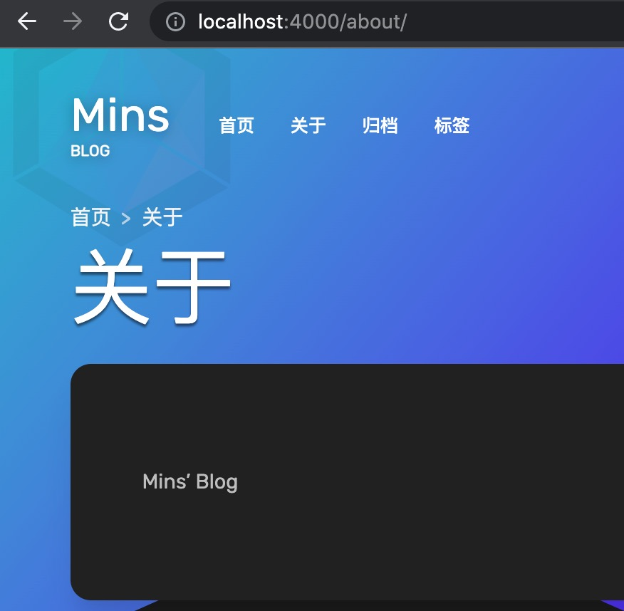
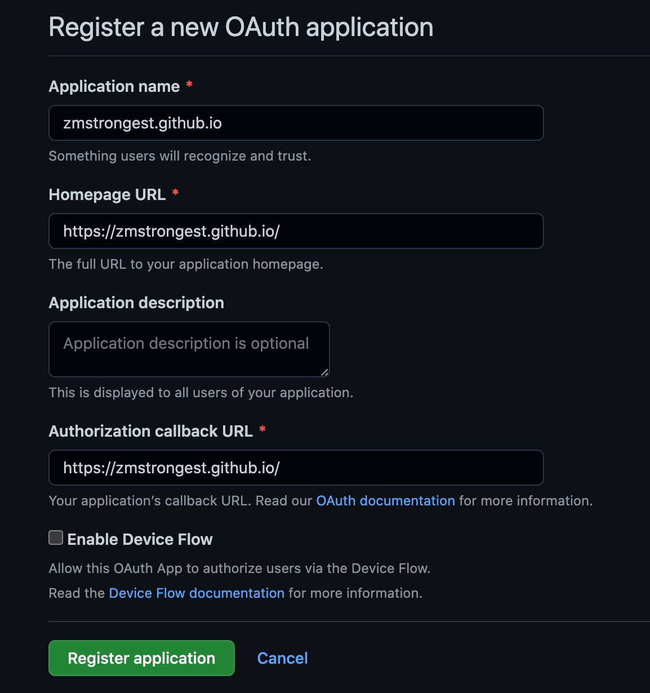

**本文将给大家分享个人博客搭建的详细步骤，以及搭建过程中踩到的坑，希望能够帮助大家快速搭建自己的博客，能够记录开发过程中遇到的问题和总结出的经验。**

*博主选的是 Github Pages + Hexo + Aurora主题，如果是自己有时间和兴趣去写动态网页的博客，需要自己购买服务器和域名比较麻烦，还是比较推荐直接用现成静态网页去做比较好，省时省力也省钱，也能满足绝大部分功能了*

**准备工作:** *Node.js  Git 搭建博客依赖的环境*

*Hexo Doc: https://hexo.io/zh-cn/docs/*


### 1.  站点选型

> Github Pages

​		由于Github是国外站点，没有梯子时不时都会抽风，但Github有个好处是申请Github Pages不需要上传自己身份证信息(我就是因为太懒不想上传哈哈)，如果不想折腾，能接受有时候蜗牛一样的访问速度，推荐使用Github Pages。下面是Github Pages的整合步骤。

1. 创建 Github 仓库



看网上大部分文章都说仓库名命名如果是 {github用户名}.github.io ，仓库就会自动开启 github pages，仓库名直接用github用户名好像也可以(可以试试)，这样访问github pages的时候域名直接就可以用 {github用户名}.github.io 访问，否则就要在域名后面加上仓库名称才能访问自己的博客

2. 设置 github pages



* 如果是用用户名创建了仓库，直接访问上述的域名即可，如果是自己有申请独立域名，可以在下方的 Custom domain设置自定义域名

* 同时可以选择自己编译后的静态网页部署在哪个分支，可以在 Branch 选项设置分支，以及保存的根目录路径

> Gitee Pages

​		Gitee Pages 其实和 Github Pages 的区别不大，博主本来也是打算用 Gitee 来搭建的，但是之前没有现成的身份证正反面以及手持身份证的照片，就没选择这种方式。

1. 创建 Gitee 仓库



和 Github 一样，以用户名作为仓库的名称，创建一个存放静态网页文件的仓库

2. 开启 Gitee Pages 功能

在 *服务* 菜单里面开启 Gitee Page 功能，如果之前没有做过实名认证，是需要上传身份证资料的，根据自己的情况选择是不是要上传，不实名认证是无法开启这个功能的



---

### 2. Hexo

> 安装步骤

*Hexo* 利用 *Node.js* 和  *NPM* 安装比较方便，在安装前需前往 *Node.js* 官网先安装好环境，同时需要安装 *Git*

#### 2.1 npm 安装 Hexo

在自己的项目目录里面创建一个文件夹用来保存 Hexo 项目，安装好 Node npm 和 Git 环境后，执行安装命令

``` shell
npm install hexo --save
```

执行完成后可以执行命令查看版本，执行看到有 *hexo-cli* 的版本号就说明成功安装了

```shell
hexo -version
```

安装 *hexo git* 的插件

 ```shell
npm install hexo-deployer-git --save
 ```

初始化 hexo 项目，后面上传的文件夹就是初始化后的目录

```shell
hexo init <要创建的目录名称>
```

进入到刚才创建的项目目录里面,安装所有依赖的包

```shell
npm install
```

安装完成后，可以看到目录结构如下图



执行以下 hexo 的命令，即可在本地生成静态网页文件并运行

```shell
#清空hexo所有已经生成的静态网页文件，如果修改了 yaml 配置文件一定要先执行此命令清空
hexo clean 
#也可以简写成
hexo cl
```

执行完清理命令后，需要执行生成静态网页文件的命令

```shell
#生成静态网页文件
hexo generate
#也可以简写成
hexo g
```

生成完成后，可以现在本地运行，运行成功后访问 https://localhost:4000 访问本地博客，也可以指定运行的端口，看自己需求

```shell
#不指定端口运行，默认4000端口启动
hexo server
#也可以简写成
hexo s
#如果需要指定端口，则执行以下命令
hexo server -p 8000
#简写也是可以的
hexo s -p 8000
```

#### 2.2 主题安装

默认的主题是真的很默认，可以自行到 Hexo 官网的主题库中挑选自己喜欢的主题，我选的是三钻的 Aurora 主题，能用 npm 安装而且有自己的主题文档，十分方便，而且确实很好看，第一眼就被吸引了。

*Hexo 主题库: https://hexo.io/themes/*

*Aurora Doc*: https://aurora.tridiamond.tech/zh/guide/

下面我以 Aurora 为例安装主题，可能有部分主题不支持 npm 安装，需要手动保存文件夹再做处理，具体可以根据选择的主题文档完成安装操作

1. 在控制台中，进入 Hexo 项目的根目录，执行主题安装命令

```shell
npm install hexo-theme-aurora --save
```

2. 因为主题是使用 NPM 或者 Yarn 安装的，而不是 clone 到 themes 文件夹的。所以我们需要自己创建一个配置文件。你只需要在 Hexo 博客的根目录下创建一个 `_config.aurora.yml` 配置文件来配置主题

```shell
#命令 windows powershell 不支持，需自行在 下面的路径中找到文件后直接复制
cp -rf ./node_modules/hexo-theme-aurora/_config.yml ./_config.aurora.yml
```

3. 设置 *permalink*

因为使用了 Vue-router，Hexo 默认生成的页面和文章的 permalink 与我们 Vue router 中的 path 是不相符的，那么就会出现无法访问的问题。所以我们需要修改 Hexo 默认配置文件里面的 `permalink` 参数。


* 打开 Hexo 根目录下的 `_config.yml`

* 修改 *permalink* 参数为  `/post/:title.html`

  ```yaml
  url: https://tridiamond.tech
  permalink: /post/:title.html #更改这个参数
  permalink_defaults:
  pretty_urls:
    trailing_index: true # Set to false to remove trailing 'index.html' from permalinks
    trailing_html: true # Set to false to remove trailing '.html' from permalinks
  ```

* 设置代码高亮

最后主题是使用 `Prismjs` 来实现代码高亮显示，但 Hexo 默认是使用 `highlightjs`，因此你需要更改 Hexo 配置来使用 `Prismjs`

1. 把 `highlight` 的启用改为`false`

2. 把 `prismjs` 的启用改为`true`

3. 把 `prismjs` 下的 `preprocess` 改为 `false`

```yaml
highlight:
  enable: false #第一步
  line_number: true
  auto_detect: false
  tab_replace: ''
  wrap: true
  hljs: false
prismjs:
  enable: true #第二部
  preprocess: true #第三部
  line_number: true
  tab_replace: ''
```

* `_config.yaml` 修改主题配置

```yaml
# Extensions
## Plugins: https://hexo.io/plugins/
## Themes: https://hexo.io/themes/
theme: Aurora #改成 Aurora 主题
```

#### 2.3 创建 "About" 页面

主题默认开启了 `about` 页面，所以我们需要创建这个 about 页，要不主题就无法正常显示 about 页。

要创建这个默认的 about 页，文档里面写的那个命令执行不了，不知道是不是版本问题，执行下面这个 `Hexo 的命令`：

```bash
hexo create page about #主题文档写的这个我执行不了，提示无此命令

hexo new page about #执行这个，新建页面布局about
```

执行完毕后，你会发现在 `source/` 文件中多处了一个新的文件夹：

```bash
.
└── source
    └── about
        └── index.md
```

你可以随意修改这个 `index.md` markdown 文件中的内容，此文件的内容将会现在在我们的 about 页面中。


+ **由于无法执行文档中 create page 的命令，因此还需要多加一步，否则跳转到 About 页面后点击刷新，是会出现访问404的情况(new pages是hexo的命令，上面的命令估计是作者封装的，那几个默认页面的原理应该也是读取的type参数)**

找到 `_source/about/index.md`，在文件头上面增加一个`type`参数，表示它是一个跳转页面，这样就不会出现刷新404的情况了。

```markdown
---
title: 关于
date: 2022-08-15 18:28:35
type: about #增加这个参数
---
```

不增加的效果:



增加后的效果:




#### 2.4 重新生成与本地服务器

**使用以下命令来运行本地环境,改变了任何配置都需要重新生成 Hexo 的静态文件！** 

``` sh
hexo clean & hexo g & hexo s
```

当文件都生成完毕之后，就可以通过 [https://localhost:4000](https://localhost:4000/) 访问你的博客了。

---

### 3. Github Page 部署配置

#### 3.1 配置文件

一共有两个配置文件，一个是 **Hexo 自身**的配置，一个是**主题专用**的配置。

```bash
. # Hexo 项目根目录.
├─ _config.yml # Hexo 配置文件.
└─ _config.aurora.yml # 主题配置.
```

> 注意
>
> 大部分主题的功能都是使用主题配置文件的，但是有部分需要用到 Hexo 插件的就需要在 Hexo 的配置中修改。

#### 3.2 基础配置

我们可以使用 主题文件`_config.aurora.yml`中的`site`参数来设置我们博客的主要信息和配置。

`site` 配置拥有以下选项：

|       选项       |  接受类型   | 使用说明                                                     |
| :--------------: | :---------: | ------------------------------------------------------------ |
|    `subtitle`    |   String    | 博客自标题，页面主标题后面会跟随这个标题内容。               |
|     `author`     |   String    | 博客作者名字，或者是博客名字。会在 **header 的 logo 区域**显示，也会在**博客简介**中显示。 |
|      `nick`      |   String    | 博客子名字，会在 header 的 logo 下方显示。                   |
|  `description`   |   String    | 会在博客简介中显示，用几句话描述博主相关信息（支持 HTML 标签） |
|    `language`    |   en, cn    | 配置默认博客语言，en 是英文，cn 是中文。                     |
| `multi_language` | true, false | 开启博客的多语言支持                                         |
|      `logo`      |   String    | Logo 的图片链接 image.                                       |
|     `avatar`     |   String    | 头像的图片链接 image.                                        |
|     `beian`      |   Object    | 网站备案信息 (从版本 1.1.0 开始，这个配置拥有两个属性)       |

```yaml
site:
  subtitle: Mins's Blog 
  author: Mins #此参数将显示在左上角的logo
  nick: blog	#此参数将显示在左上角的logo
  avatar: /image/avatar.jpeg	#显示头像
  link: https://zmstrongest.github.io #博客首页地址
  description: 'Think like an artist, code like an artisan.' #显示在头像下方的个人简介
  language: cn 
  multi_language: true
  logo: https://img-blog.csdnimg.cn/20210313122054101.png
  #avatar: https://img-blog.csdnimg.cn/20210313122054101.png
  beian:
    number: ''
    link: ''
  police_beian:
    number: ''
    link: ''
```

#### 3.3 社交配置

这部分用于配置我们的社交链接，这些链接会在我们的简介中显示。

社交配置会有以下配置项：

|     配置项      | 说明                      |
| :-------------: | :------------------------ |
|    `github`     | Github 简介页链接.        |
|    `twitter`    | Twitter 个人页链接.       |
| `stackoverflow` | Stackoverflow 个人页链接. |
|     `weibo`     | 微博个人页链接.           |
|     `zhihu`     | 知乎简介页链接.           |
|     `csdn`      | CSDN 简介页链接.          |
|    `juejin`     | 掘金简介页链接.           |

配置例子：

```yaml
socials:
  github: https://zmstrongest.github.io
```

如果上面作者提供的自带博客类型不能满足你的需求，想自定义图标和连接，请自行查看 [Aurora 的文档]( https://aurora.tridiamond.tech/zh/guide/)进行配置


#### 3.4 评论区配置

* Github OAuth Application 申请

到 https://github.com/settings/applications/new 注册一个OAuth Application，后面的 Gitalk 配置需要用到，Application name 可自定义填写，Homepage URL 填写博客主页地址，Authorization callback URL 填写博客主页地址。




提交后会自动生成一个 `ClientID`和`Client Secret`，用于后续的评论区配置

---


这个主题目前支持两个不同的评论插件。您可以使用`enable`配置来打开以下一款评论插件。

> 提示
>
> 如果你同时打开了两个插件，**Gitalk**将会优先被使用。博主用的是Gitalk

* Gitalk

配置属性：

|         属性          | 描述                                                         |
| :-------------------: | :----------------------------------------------------------- |
|       `enable`        | 使用**true**开启, 使用**false**关闭                          |
|     `autoExpand`      | 如果设置为**true**, Github 评论将会自动展开。否者默认会收起。 |
|      `clientID`       | **clientID** 是你 GitHub 的 Oauth APP 中提供的。             |
|    `clientSecret`     | **clientSecret** 是你 GitHub 的 Oauth APP 中提供的。         |
|        `repo`         | 仓库名, 比如: https://github.com/auroral-ui/**hexo-theme-aurora-docs**, 名字就是 `hexo-theme-Aurora-docs` |
|        `owner`        | 仓库拥有者的用户名. 比如: `auroral-ui`                       |
|        `admin`        | 仓库管理员的用户名，这里可以填写多个管理员。(也用于标记那个评论是博主的) |
|         `id`          | **确保唯一性和长度小于 50**，如果您使用`pathname`，请确保长度小于 50 个字符或使用`uid`代替，这个有更好的兼容性 (如果您之前使用其他主题，谁用 uid 将可能无法显示您之前的评论) |
|      `language`       | 使用 `en `设置为英文，使用 `cn` 设置为中文.                  |
| `distractionFreeMode` | 与 Facebook 一样的专注模式，点击评论输入框时会让背景变暗。`true` 来开启 `false` 来关闭 |
|    `recentComment`    | 是否开启最近评论功能。                                       |
|        `proxy`        | GitHub 授权请求的反向代理                                    |

> 注意
>
> 如果你在使用 Gitalk 的时候，出现 403 或者 422 这种报错的话，请根据[这里的教程在新窗口打开](https://mjava.top/archive/33f09b03-a5a7-4d66-93d3-7063905f9b81/)，自己搭建一个反向代理服务，然后把你建立好的方向代理地址配置给 `proxy` 即可。

例子：

```yaml
gitalk:
  enable: true
  autoExpand: false
  clientID: '' #你在Github申请的ID
  clientSecret: '' #你在Github申请的Secret
  repo: '' #博客仓库的名称
  owner: 'ZmStrongest' #Github用户名
  admin: ['ZmStrongest'] #Github用户名
  id: uid
  language: cn
  distractionFreeMode: true
  recentComment: true
  #proxy: ''
```

更多的使用指南请查看 [Gitalk](https://github.com/gitalk/gitalk/blob/master/readme-cn.md) 插件的官网。

配置完成后，在博客评论区里面登录自己的 `github` 账号，进行评论区初始化即可使用，由于`github`站点可能访问较慢，可能要梯子先登录初始化一下才可以使用，博主没用梯子一直都是连接超时，初始化以后就不再需要了。

#### 3.5 机器人配置

配置例子直接可以直接复制 [Aurora 的文档]( https://aurora.tridiamond.tech/zh/guide/) 进行配置

#### 3.6 Github 部署配置

上面讲完了主题的配置文件，现在还需要对 Hexo 的原始配置文件 `_config.yml` 进行配置修改

* 配置好`github`的`ssh`以后，复制博客在`github`的仓库地址，并且根据自身情况创建存储博客静态网页内容的分支进行部署提交

```yaml
# Deployment
## Docs: https://hexo.io/docs/one-command-deployment
deploy:
  type: git
  repo: ''  #github仓库地址
  branch: master #分支名称
```

* 配置完成后，可以即可通过`hexo`命令部署到`Github Pages`上

```sh
hexo deploy 
#或者
hexo d #简写
```

访问自己之前配置的博客主页地址即可生效，[博客地址](https://zmstrongest.github.io/) ，到这里 Github Pages + Hexo + Aurora 主题的配置就完成了，后续有自定义的需求可以自行参照 `Hexo`和`Aurora`的文档进行个性化设置。

#### 3.7 文章编写

配置完成后，即可开始记录自己的文章了

你可以执行下列命令来创建一篇新文章或者新的页面。

```sh
$ hexo new [layout] <title>
```

您可以在命令中指定文章的布局（layout），默认为 `post`，可以通过修改 `_config.yml` 中的 `default_layout` 参数来指定默认布局。布局（Layout）

Hexo 有三种默认布局：`post`、`page` 和 `draft`。在创建这三种不同类型的文件时，它们将会被保存到不同的路径；而您自定义的其他布局和 `post` 相同，都将储存到 `source/_posts` 文件夹。

| 布局    | 路径             |
| :------ | :--------------- |
| `post`  | `source/_posts`  |
| `page`  | `source`         |
| `draft` | `source/_drafts` |

* 文件名称

Hexo 默认以标题做为文件名称，但您可编辑 `new_post_name` 参数来改变默认的文件名称，举例来说，设为 `:year-:month-:day-:title.md` 可让您更方便的通过日期来管理文章。

| 变量       | 描述                                |
| :--------- | :---------------------------------- |
| `:title`   | 标题（小写，空格将会被替换为短杠）  |
| `:year`    | 建立的年份，比如， `2015`           |
| `:month`   | 建立的月份（有前导零），比如， `04` |
| `:i_month` | 建立的月份（无前导零），比如， `4`  |
| `:day`     | 建立的日期（有前导零），比如， `07` |
| `:i_day`   | 建立的日期（无前导零），比如， `7`  |

* 草稿

刚刚提到了 Hexo 的一种特殊布局：`draft`，这种布局在建立时会被保存到 `source/_drafts` 文件夹，您可通过 `publish` 命令将草稿移动到 `source/_posts` 文件夹，该命令的使用方式与 `new` 十分类似，您也可在命令中指定 `layout` 来指定布局。

```
$ hexo publish [layout] <title>
```

草稿默认不会显示在页面中，您可在执行时加上 `--draft` 参数，或是把 `render_drafts` 参数设为 `true` 来预览草稿。

