> 在刷 leetcode 题目的时候，有部分题目的解题方法都用到了位运算来解决二进制或者部分数学题目，能够减少部分题目的运行时间，但因为平时用的比较少，也没有深入了解过，本篇文章将记录 Java 位运算的知识点，同时不断更新位运算的运用场景，用好位运算在某些场景能够减少许多逻辑计算和判断


### 一、位运算规则

以十进制数为例，Java 数值运算过程中都是先将十进制转换为二进制然后再进行运算，再把二进制数据转换为十进制展现给用户。二进制运算规则如下：

对于有符号的而言，

- 最高位为符号位，0表示正数，1表示负数
- 正数的原码，反码和补码都一样
- 负数的反码：符号位保持不限，其他位取反
- 负数的补码：反码 + 1
- 0的反码和补码都是0
- 计算机的运算的时候，都是将原码**转成补码进行运算**的


以32位的负数 int 为例，以下为转码规则

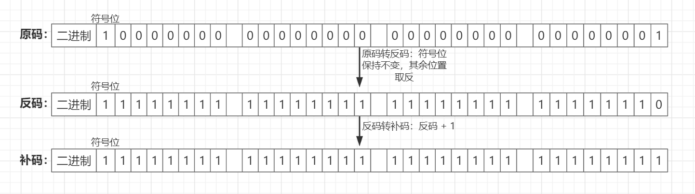

博主自己写了个int数据类型的转码方法，可以自己运行看看二进制的结果

``` java
/**
     * 打印原码
     */
    public void original(int num) {
        //正数处理逻辑
        if (num >= 0) {
            for (int i = 31; i >= 0; i--) {
                System.out.print((num & (1 << i)) == 0 ? "0" : "1");
            }
        } 
      	//负数除符号位，其余位置跟他的相反数一致
        else {
            System.out.print("1");
            num = -num;
            for (int i = 30; i >= 0; i--) {
                System.out.print((num & (1 << i)) == 0 ? "0" : "1");
            }
        }
        System.out.println();
    }

    /**
     * 打印反码
     */
    public void reverse(int num) {
        //正数反码与原码一致
        if (num >= 0)
            original(num);
        else {
            System.out.print("1"); //打印负数符号位
            num = -num;
            for (int i = 30; i >= 0; i--) {
                System.out.print((num & (1 << i)) == 0 ? "1" : "0");
            }
            System.out.println();
        }
    }

    /**
     * 打印补码
     */
    public void repair(int num) {
        if (num >= 0)
            original(num);
        else {
            StringBuilder sb = new StringBuilder();
            int isAdd = 1; //补码加1
            num = -num;
            for (int i = 0; i < 31; i++) {
                int tempNum = ((num & (1 << i)) == 0) ? 1 : 0;
                int sum = tempNum + isAdd;
                if (sum > 1) {
                    tempNum = 0;
                    isAdd = 1;
                } else {
                    tempNum = sum;
                    isAdd = 0;
                }
                sb.append(tempNum);
            }
            sb.append(1); //负数符号位
            System.out.println(sb.reverse().toString());
        }
    }

```


---


### 二、Java 支持的位运算符

* 与（&）：二元运算符，两个为1时结果为1，否则为0
* 或（|）：二元运算符，两个其中有一个为1时结果就为1，否则为0
* 异或（^）：二元运算符，两个数同时为1或0时结果为1，否则为0
* 取非（~）：一元运算符，取反操作
* 左移（<<）：一元运算符，按位左移一定的位置。高位溢出，低位补符号位，符号位不变。
* 右移（>>）：一元运算符，按位右移一定的位置。高位补符号位，符号位不变，低位溢出。
* 无符号右移（>>>）：一元运算符，符号位（即最高位）保留，其它位置向右移动，高位补零，低位溢出
  

---


### 三、逻辑运算

#### 1. 与运算

> 运算规则

两个数字相同位置的 bit 进行对位运算，**若两个值都是1，则等于1，否则等于0**

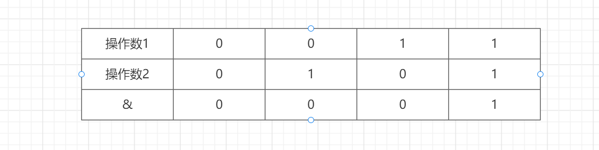

> 运算过程

以 1 & -5 = 0为例子展示运算流程：

1) 因为1为正数，所以原码和补码相同，即1的补码为：00000000 0000000 00000000 00000001

* 因为-5为负数，所以需要进行原码 >>> 反码 >>> 补码的转换

原码：10000000 00000000 00000000 00000101

反码：11111111 11111111 11111111 11111010

补码：11111111 11111111 11111111 11111011

* & 运算：  

00000000 0000000 00000000 00000001

1111111 11111111 11111111 11111011         

00000000 00000000 00000000 00000001

* 得到的补码结果为：00000000 00000000 00000000 0000001 所以结果为1

#### 2. 或运算

>  运算规则

两个数字相同位置的 bit 进行对位运算，**其中一个值为1，都等于1，否则等于0**

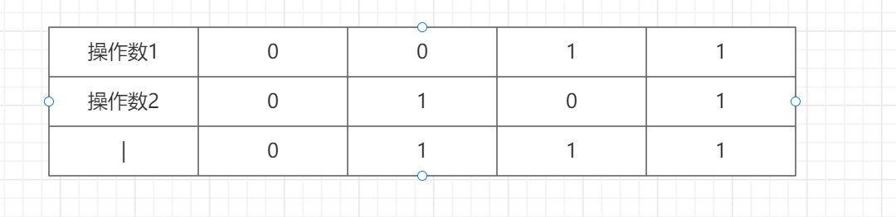

> 运算过程

以 -2 | 5 = -1为例展示运算流程：

* -2为负数，需要进行原码 > 反码 > 补码的转换。转换步骤如下：　

原码：10000000 00000000 00000000 00000010\

符号位不变，其他位置取反得反码：11111111 11111111 11111111 11111101

在反码的基础上＋1得到补码： 11111111 11111111 11111111 11111110

* 5为正数，补码和反码一致，所以5的补码为：00000000 00000000 00000000 00000101
* 将-2 和 5 的补码进行或运算

11111111 11111111 11111111 11111110

00000000 00000000 00000000 00000101 

11111111 11111111 11111111 11111111

* 根据上面的运算得到补码结果为：11111111 11111111 11111111 11111111

* 结果显然是一个负数，而负数的补码和原码不一致，所以需要将补码结果转换为原码才能得到最终的结果

* 补码转原码的过程是跟原码转补码相反的过程，具体过程如下：

补码：11111111 11111111 11111111 11111111

补码 -1 得到反码：11111111 11111111 11111111 11111110

符号位不变，其他位置取反得：10000000 00000000 00000000 00000001

* 最终得到的原码结果为 10000000 00000000 00000000 00000001，转成十进制为 -1

#### 3. 异或

> 运算规则

两个数相同位置的 bit 进行或运算，若两个数均为0或1，则等于0，否则等于1

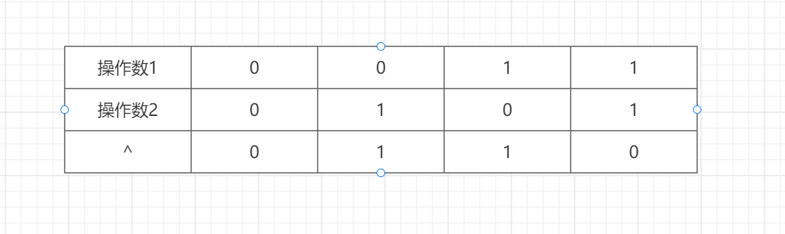

> 运算过程

以 1 ^ -5 = 6 为例，具体运算流程如下：

- 1的补码为：00000000 00000000 00000000 00000001

- -5的补码为：11111111 11111111 11111111 11111011（可参考与运算给出的流程）

- 两个补码运算：　　

00000000   00000000   00000000    00000001

11111111   11111111   11111111    11111011

11111111   11111111  11111111     11111010

- 得到的补码结果为：11111111   11111111  11111111   11111010

- 补码为负数，需要转换成原码：

补码：11111111   11111111  11111111   11111010

反码：11111111   11111111  11111111   11111001

原码：10000000   00000000  00000000   00000110

* 由原码：10000000 00000000 00000000 000000110，得出最终的时间结果为 -6.

#### 4. 非

> 运算规则

若位数为0，则取反后为1，若为1，取反后为0

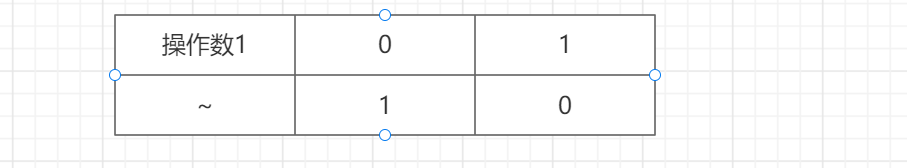

> 运算过程

以~2 = -3为例运算流程如下：

1) 2的原码为：00000000 00000000 00000000 00000010

2) 2的补码跟原码一致也为：00000000 00000000 00000000 00000010

3) 取反：111111111 11111111 11111111 11111101

4) 取反后的结果仍未补码，此时补码为负数，则需要转成原码

5) 11111111 11111111 11111111 11111101 减 1 得到反码：11111111 11111111 11111111 11111100

6) 11111111 11111111 11111111 11111100 符号位不变，其他位置取反得到原码为：10000000 00000000 00000000 00000011

7) 10000000 00000000 00000000 00000011 转成十进制结果为 -3

#### 5. 左移

> 运算规则

符号位不变，高位溢出截断，低位补零。比如 -1 << 2 = -4 (为方便讲解，图示的补码为-1)

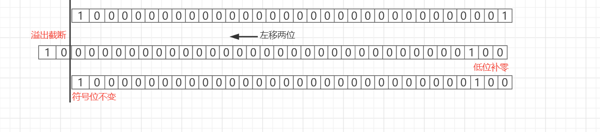


#### 6. 右移

> 运算规则

符号位不变，低位溢出截断，高位用符号位填充。如：8 >> 2 = 2

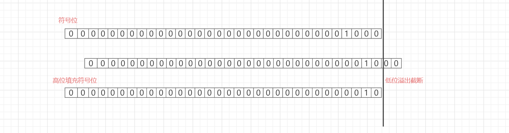

#### 7. 无符号右移

> 运算规则

高位填充0，低位溢出。如-1>>>1=2147483647

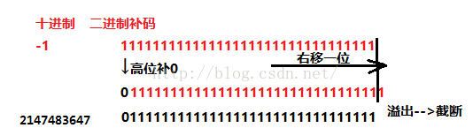


---


### 四、应用场景

#### 1. 二进制奇偶判断操作

例如一个数 & 1的结果就是取二进制的最末位。这可以用来判断一个整数的奇偶，二进制的最末位为0表示该数为偶数，最末位为1表示该数为奇数。

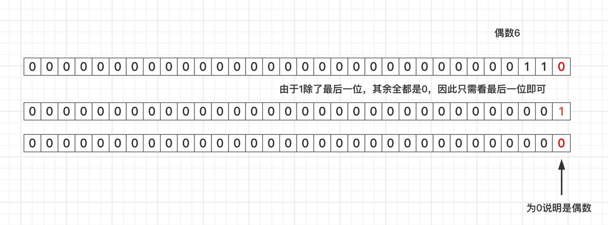

#### 2. 左移位实现2的幂次方

例如2的4次方，可以利用左移4位达到目的，2<<4等于32，符号位不变，可以看到1的位置左移以后，后面补了4个0，转成十进制等于32

>1. 数值value向左移动num位，左边二进制位丢弃，右边补0。（注意byte和short类型移位运算时会变成int型，结果要强制转换）
>
>2. 若1被移位到最左侧，则变成负数
>
>3. 左移时舍弃位不包含1，则左移一次，相当于乘2。

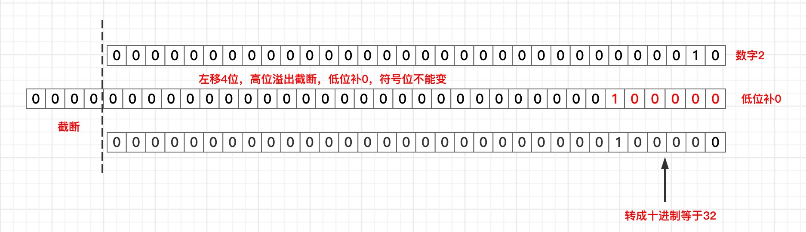


#### 3. 右移位实现根号2

例如32右移4位，符号位不变，可以看到1的位置右移以后，前面补了4个0，转成十进制等于2

> 1. 数值value向右移动num位，正数左补0，负数左补1，右边舍弃。（即保留符号位）
>
> 2. 右移一次，相当于除以2，并舍弃余数。
>
> 3. 无符号右移>>>：左边位用0补充，右边丢弃。

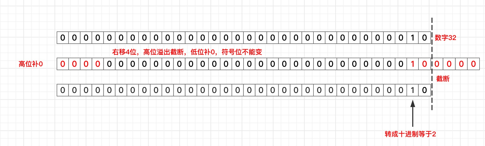


#### 4. 异或相同的数等于它本身
例如力扣题目 [136. 只出现一次的数字](https://leetcode.cn/problems/single-number/description/)，在数组[4,1,2,1,2]中寻找只出现一次的数字4，正常解法是借助map之类的数据结构计数，找到出现次数为1的数字，但复杂度为O(n)，使用异或运算将大幅降低时间和空间的复杂度.

```java
if (nums.length < 1)
   return 0;

int res = nums[0];
for (int i = 1; i < nums.length; i++) {
    res = nums[i] ^ res;
}

return res;
```

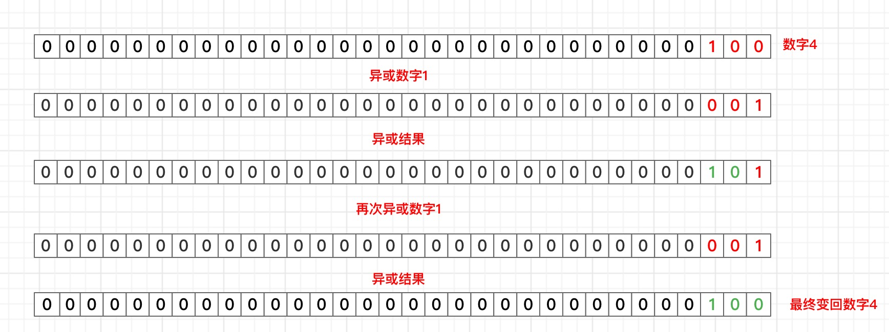


部分内容来源博文: [Java 位运算详解](https://blog.csdn.net/weixin_39410864/article/details/123000487)

