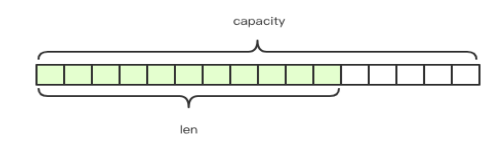
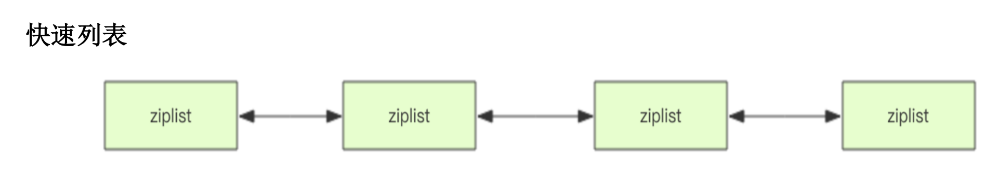
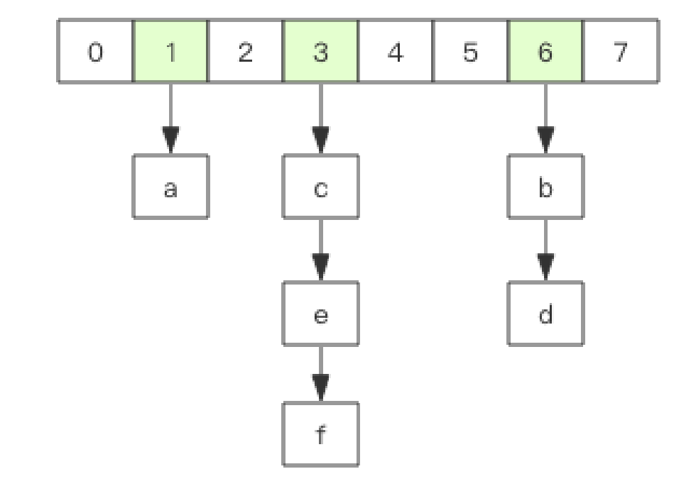
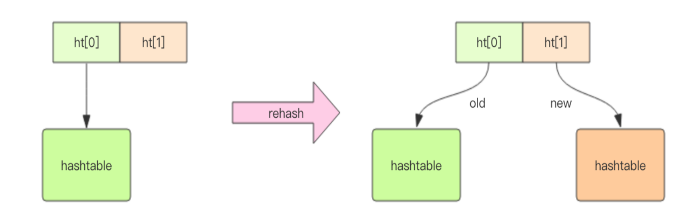
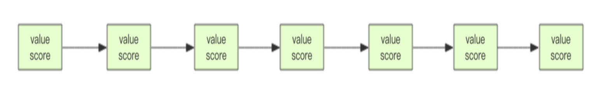
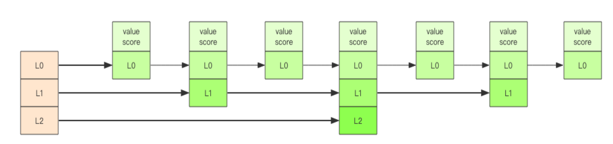

> 本篇文章将介绍Redis的基础数据结构和命令，熟练掌握了Redis的基础知识，才能更好的深入了解Redis的进阶底层原理

### 一、Redis基础数据结构

*Redis* 有 *5* 种基础数据结构，分别为：*string (字符串)、list (列表)、set (集合)、hash (哈 希) 和 zset (有序集合)*

#### 1. string 字符串

字符串 *string* 是 *Redis* 最简单的数据结构。Redis 所有的数据结构都是以唯一的 *key* 字符串作为名称，然后通过这个唯一 *key* 值来获取相应的 *value* 数据。不同类型的数据结构的差异就在于 *value* 的结构不一样


字符串结构使用非常广泛，一个常见的用途就是缓存用户信息。我们将用户信息结构体使用 *JSON* 序列化成字符串，然后将序列化后的字符串塞进 *Redis* 来缓存。同样，取用户信息会经过一次反序列化的过程。



*Redis* 的字符串是动态字符串，是可以修改的字符串，内部结构实现上类似于 *Java* 的 *ArrayList*，采用预分配冗余空间的方式来减少内存的频繁分配，如图中所示，内部为当前字符串实际分配的空间 *capacity* 一般要高于实际字符串长度 *len*。当字符串长度小于 *1M* 时，扩容都是加倍现有的空间，如果超过 *1M*，扩容时一次只会多扩 *1M* 的空间。需要注意的是字符串最大长度为 *512M*。

##### 设置和读取键值对命令

```redis
# 添加单个 redis 键值对
set [key] [value]

# 获取单个 redis key 对应的值
get [key]

# 删除单个 redis 键值对
del [key]

# 批量添加键值对
mset [key1] [value1] [key2] [value2] [key3] [value3]

# 批量获取 value
mget [key1] [key2] [key3]
```

##### 过期和 set 命令拓展

可以对 *key* 设置过期时间，到点自动删除，这个功能常用来控制缓存的失效时间

```redis
# 设置键值对过期时间
set [key] [value]
expire [key] [过期秒数]

# 查看过期时间
ttl [key]

# 设置键值对同时设置过期时间 等价于 set + expire
setex [key] [过期秒数] [value]

# 如果 key 不存在，则新建，否则不处理，直接使用 set 会覆盖原值
setnx [key] [value]
```

##### 计数
如果 *value* 值是一个整数，还可以对它进行自增操作。自增是有范围的，它的范围是 *signed long* 的最大最小值，超过了这个值，*Redis* 会报错

```redis
# 不指定增加长度则默认自增1
set [key] 30

incr [key]
> 31

# 指定增加长度
incrby [key] 5
> 36

incrby [key] -5
> 31

# Long.Max
set [key] 9223372036854775807
incrby [key] 5
> (error) ERR increment or decrement would overflow 

```

#### 2. list 列表

*Redis* 的列表相当于 *Java* 语言里面的 *LinkedList*，注意它是链表而不是数组。这意味着 *list* 的插入和删除操作非常快，时间复杂度为 *O(1)*，但是索引定位很慢，时间复杂度为 *O(n)*

当列表弹出了最后一个元素之后，该数据结构自动被删除，内存被回收

*Redis* 的列表结构常用来做异步队列使用。将需要延后处理的任务结构体序列化成字符串塞进 *Redis* 的列表，另一个线程从这个列表中轮询数据进行处理

```redis 
# 添加列表元素，其中push命令可以使用 lpush 和 rpush ，l代表在列表开头添加新元素，r代表在列表末尾添加新元素
lpush list 1 2 3 4 5 6
> [6,5,4,3,2,1]
rpush list 1 2 3 4 5 6
> [1,2,3,4,5,6]

# 查询列表长度
llen list
> (integer) 6

# 弹出列表元素，和 push 类似，可以有 lpop 和 rpop ，组合使用达到不同的集合效果
list:[1,2,3,4,5,6]

lpop list
> 1
rpop list
> 6

```

*lindex* 相当于 *Java* 链表的 *get(int index)* 方法，它需要对链表进行遍历，**性能随着参数 index 增大而变差**。 *ltrim* 和字面上的含义不太一样，个人觉得它叫 *lretain(保留)* 更合适一些，因为 *ltrim* 跟的两个参数 *start_index* 和 *end_index* 定义了一个区间，在这个区间内的值，*ltrim* 要保留，区间之外统统砍掉。我们可以通过 *ltrim* 来实现一个定长的链表，这一点非常有用。*index* 可以为负数，*index=-1* 表示倒数第一个元素，同样 *index=-2* 表示倒数第二个元素。

```redis
# lindex 根据索引获取值
list:[1,2,3,4,5,6]

lindex list 1
> (integer) 2

# ltrim 只保留区间索引的值
ltrim list 1 -1 
> list:[2,3,4,5,6] 

# lrange 输出区间索引的值
lrange list 3 -1
> list: [4,5,6]
```

##### 快速列表



如果再深入一点，你会发现 *Redis* 底层存储的还不是一个简单的 *linkedlist*，而是称之为快速链表 *quicklist* 的一个结构。首先在列表元素较少的情况下会使用一块连续的内存存储，这个结构是 *ziplist*，也即是压缩列表。它将所有的元素紧挨着一起存储，分配的是一块连续的内存。当数据量比较多的时候才会改成 quicklist。因为普通的链表需要的附加指针空间太大，会比较浪费空间，而且会加重内存的碎片化。比如这个列表里存的只是 *int* 类型的数据，结构上还需要两个额外指针 *prev* 和 *next* 。所以 Redis 将链表和 *ziplist* 结合起来组成了 *quicklist*。也就是将多个 *ziplist* 使用双向指针串起来使用。这样既满足了快的插入删除性能，又不会出现太大的空间冗余。

#### 3. hash字典

*Redis* 的字典相当于 *Java* 语言里面的 *HashMap*，它是无序字典。内部实现结构上同 *Java* 的 *HashMap* 也是一致的，同样的数组 + 链表二维结构。第一维 *hash* 的数组位置碰撞时，就会将碰撞的元素使用链表串接起来。



不同的是，*Redis* 的字典的值只能是字符串，另外它们 *rehash* 的方式不一样，因为 *Java* 的 *HashMap* 在字典很大时，*rehash* 是个耗时的操作，需要一次性全部 *rehash*。*Redis* 为了高性能，不能堵塞服务，所以采用了渐进式 *rehash* 策略。



渐进式 *rehash* 会在 *rehash* 的同时，保留新旧两个 *hash* 结构，查询时会同时查询两个 *hash* 结构，然后在后续的定时任务中以及 *hash* 的子指令中，循序渐进地将旧 *hash* 的内容一点点迁移到新的 *hash* 结构中。

- 当 *hash* 移除了最后一个元素之后，该数据结构自动被删除，内存被回收。*hash* 结构也可以用来存储用户信息，不同于字符串一次性需要全部序列化整个对象，*hash* 可以对用户结构中的每个字段单独存储。这样当我们需要获取用户信息时可以进行部分获取。而以整个字符串的形式去保存用户信息的话就只能一次性全部读取，这样就会比较浪费网络流量。
- *hash* 也有缺点，*hash* 结构的存储消耗要高于单个字符串，到底该使用 *hash* 还是字符串，需要根据实际情况再三权衡。

```redis
# 创建 hash 表
hset hashmap [key] [value]

# 获取 hash 表的值
hget hashmap [key]

# 批量创建 hash 表键值对
hmset hashmap [key1] [value1] [key2] [value2] [key2] [value2]

# 批量获取 hash 表键值对
hmget hashmap [key1] [key2] [key3]

# 获取 hash 表的所有key
hkeys hashmap

# 获取 hash 表所有键值对，key 和 value 依次输出
hgetall hashmap

# 获取 hash 表的键值对长度
hlen hashmap

```

同字符串一样，*hash* 结构中的单个子 *key* 也可以进行计数，它对应的指令是 *hincrby*， 和 *incr* 使用基本一样

```redis
# 给 hash 表中数字的值做增减
age : 18

hincrby hashmap age 5
> (integer) 23
```

#### 4. set 集合

*Redis* 的集合相当于 *Java* 语言里面的 *HashSet*，它内部的键值对是无序的唯一的。它的内部实现相当于一个特殊的字典，字典中所有的 *value* 都是一个值 *NULL*。当集合中最后一个元素移除之后，数据结构自动删除，内存被回收。 *set* 结构可以用来存储活动中奖的用户 *ID*，因为有去重功能，可以保证同一个用户不会中奖两次。

```redis
# 添加元素
sadd hashset <value>
> (integer) 1
# 添加重复元素
sadd hashset <value>
> (integer) 0
# 批量添加元素和单个是一样的命令
sadd hashset <value1> <value2> <value3>...

# 查询 set 的所有值 该集合是无序的
smembers hashset

# 判断 set 中是否存在该值
sismember hashset <value>
> (integer) 1

# 获取 set 长度
scard hashset
> (integer) 1

# 取出一个元素 （无序）
spop hashset
> <value>

```

#### 5. 有序列表 zset

*zset* 可能是 *Redis* 提供的最为特色的数据结构，它也是在面试中面试官最爱问的数据结构。它类似于 *Java* 的 *SortedSet* 和 *HashMap* 的结合体，一方面它是一个 *set*，保证了内部 *value* 的唯一性，另一方面它可以给每个 *value* 赋予一个 *score*，代表这个 *value* 的排序权重。它的内部实现用的是一种叫着*「跳跃列表」*的数据结构。*zset* 中最后一个 *value* 被移除后，数据结构自动删除，内存被回收。 *zset* 可以用来存粉丝列表，*value* 值是粉丝的*用户 *ID，*score* 是关注时间。我们可以对粉丝列表按关注时间进行排序。*zset* 还可以用来存储学生的成绩，*value* 值是*学生的 ID*，*score* 是他的考试成绩。我们可以对成绩按分数进行排序就可以得到他的名次。

```redis
# 添加有序列表元素
zadd sortmap <score> <value>
zadd sortmap 8.1 "I love Java"
zadd sortmap 7.1 "I love Python"
zadd sortmap 6.1 "I love Php"

# 列出索引区间的元素,按 score 升序列出，参数区间为排名范围
zrange sortmap 0 -1  
> "I love Php"
> "I love Python"
> "I love Java"

# 逆序列出索引区间的元素,按 score 降序列出，参数区间为排名范围
zrevrange sortmap 0 -1
> "I love Java"
> "I love Python"
> "I love Php"

# 输出集合长度
zcard sortmap
> (integet) 3

# 获取指定 value 值的 score
zscore "I love Python"
> 7.0999999999999996  # double 会有精度问题

# 根据 score 区间分值获取元素
zrangebyscore sortmap 0 8
> "I love Python"   
> "I love Php"

# 删除 value
zrem sortmap "I love Java"

```
 ##### 跳跃列表

*zset* 内部的排序功能是通过*「跳跃列表」*数据结构来实现的，它的结构非常特殊，也比较复杂。因为 *zset* 要支持随机的插入和删除，所以它不好使用数组来表示。我们先看一个普通的链表结构。



我们需要这个链表按照 score 值进行排序。这意味着当有新元素需要插入时，要定位到特定位置的插入点，这样才可以继续保证链表是有序的。通常我们会通过二分查找来找到插入点，但是二分查找的对象必须是数组，只有数组才可以支持快速位置定位，链表做不到，那该怎么办？

想想一个创业公司，刚开始只有几个人，团队成员之间人人平等，都是联合创始人。随着公司的成长，人数渐渐变多，团队沟通成本随之增加。这时候就会引入组长制，对团队进行划分。每个团队会有一个组长。开会的时候分团队进行，多个组长之间还会有自己的会议安排。公司规模进一步扩展，需要再增加一个层级 —— 部门，每个部门会从组长列表中推选出一个代表来作为部长。部长们之间还会有自己的高层会议安排。跳跃列表就是类似于这种层级制，最下面一层所有的元素都会串起来。然后每隔几个元素挑选出一个代表来，再将这几个代表使用另外一级指针串起来。然后在这些代表里再挑出二级代表，再串起来。最终就形成了金字塔结构。 想想你老家在世界地图中的位置：亚洲- ->中国->安徽省->安庆市->枞阳县->汤沟镇->田间村->xxxx 号，也是这样一个类似的结构。



*「跳跃列表」*之所以*「跳跃」*，是因为内部的元素可能*「身兼数职」*，比如上图中间的这个元素，同时处于 L0、L1 和 L2 层，可以快速在不同层次之间进行*「跳跃」*。定位插入点时，先在顶层进行定位，然后下潜到下一级定位，一直下潜到最底层找到合适的位置，将新元素插进去。你也许会问，那新插入的元素如何才有机会*「身兼数职」*呢？跳跃列表采取一个随机策略来决定新元素可以兼职到第几层。首先 L0 层肯定是 *100%* 了，L1 层只有 *50%* 的概率，L2 层只有 *25%* 的概率，L3 层只有 *12.5%* 的概率，一直随机到最顶层 L31 层。绝大多数元素都过不了几层，只有极少数元素可以深入到顶层。列表中的元素越多，能够深入的层次就越深，能进入到顶层的概率就会越大。


### 二、 容器型数据结构的通用规则

**list/set/hash/zset 这四种数据结构是容器型数据结构，它们共享下面两条通用规则：**

#### 1、create if not exists 
如果容器不存在，那就创建一个，再进行操作。比如 *rpush* 操作刚开始是没有列表的，*Redis* 就会自动创建一个，然后再 *rpush* 进去新元素。

#### 2、drop if no elements 
如果容器里元素没有了，那么立即删除元素，释放内存。这意味着 *lpop* 操作到最后一个元素，列表就消失了。过期时间 *Redis* 所有的数据结构都可以设置过期时间，时间到了，*Redis* 会自动删除相应的对象。需要注意的是过期是以对象为单位，比如一个 *hash* 结构的过期是整个 *hash* 对象的过期，而不是其中的某个子 *key*。还有一个需要特别注意的地方是如果一个字符串已经设置了过期时间，然后你调用了 *set* 方法修改了它，它的过期时间会消失。

```redis
set codehole yoyo 
> OK 
expire codehole 600 
> (integer) 1 
ttl codehole 
> (integer) 597 
set codehole yoyo 
> OK 
ttl codehole 
> (integer) -1

```


> 部分内容摘录自**《Redis深度历险：核心原理和应用实践》**这本书，有兴趣的朋友可以阅读这本书了解更多关于 Redis 的知识